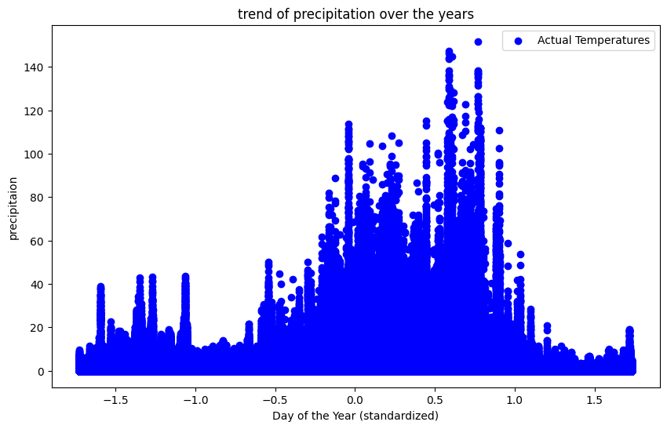
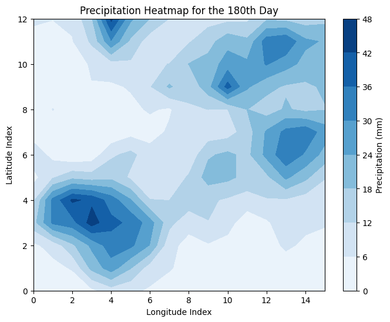
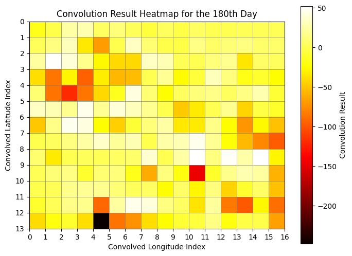
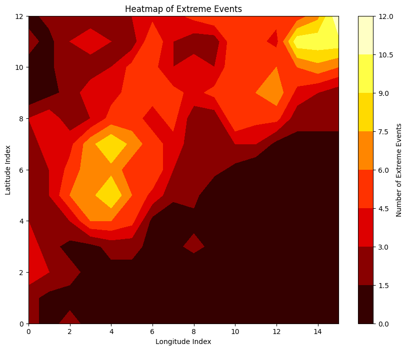
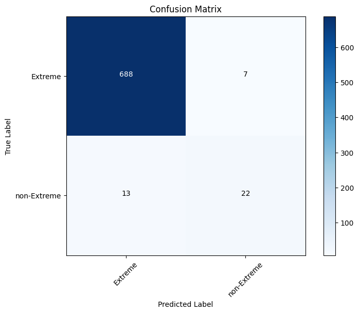

<div style="text-align: center;">

# Extreme Event Detection and Classification using Convolution and CNN

</div>

<div style="text-align: center;">

*Vedanshi Vagehla*, *Rohit Kumar*
</div>

<div style="text-align: center;">

 *Indian Institute of Science Education and Research Bhopal*
</div>

---
<div style="text-align: center;">

#### **Abstract**

*Testing a CNN classifier to see how well would it could classify extreme events in comparison to ANN doing the classification.*

</div>

---
<div>

## ***1. Introduction***
<section>

<p class="intro" style="text-align: left;">

### **1.1 Problem statement:**
- Extreme weather events, such as hurricanes, floods, wildfires, and heatwaves, pose significant threats to human life, infrastructure, and ecosystems. These events have been increasing in frequency and intensity due to climate change, making their timely and accurate detection more critical than ever. Traditional methods for identifying extreme weather events often rely on manual analysis by meteorologists or heuristic-based algorithms. These methods are not only time-consuming and labor-intensive but also susceptible to human error and may lack the precision needed to handle the complex and dynamic nature of weather patterns.

- With the advent of modern data acquisition technologies, there is an abundance of high-resolution environmental data available from various sources such as satellite imagery, weather radars, ground-based sensors, and remote sensing devices. However, the sheer volume and complexity of this data present significant challenges for effective analysis and real-time processing. Existing machine learning models have shown promise in analyzing such data, but they often struggle with the variability and unpredictability inherent in extreme weather events, leading to suboptimal performance in detection and classification tasks.

- This research seeks to address these challenges by developing a Convolutional Neural Network (CNN) model specifically designed for the detection and classification of extreme weather events. The use of CNNs is motivated by their proven ability to automatically learn hierarchical feature representations from raw data, making them particularly well-suited for image and pattern recognition tasks. By leveraging custom-designed convolutional filters, this research aims to enhance the model's ability to capture critical features indicative of extreme weather conditions.

- This system will not only improve the accuracy and speed of detection but also reduce the reliance on manual analysis, thereby enhancing overall disaster preparedness and response efforts. The primary goal is to create a robust and efficient CNN-based system capable of processing large-scale environmental datasets in real-time, providing accurate and timely alerts for extreme weather events. 
</p>
<p class="aim" style="text-align: right;">

### **1.2 Aim:**
- The aim of this research is to create a CNN-based system that automatically detects and classifies extreme weather events using large-scale environmental data. By focusing tailored model architecture, rigorous training and evaluation, real-time processing capabilities and effective visualization tools, the research seeks to address the limitations of current methods and provide a scale-able, accurate, and efficient solution for extreme event detection. The ultimate goal is to enhance disaster preparedness and response efforts, contributing to improved safety and resilience in the face of increasing extreme weather events driven by climate change.
</p>
</section>
</div>
<div>
<section>

## ***2. Data***
<p class="data">

- the data used is global PERCDR data from 2001 to 2010 which is available at 30 km resolution and is used as test and train data for the model by performing the 80-20 split, it follows a general distribution as follows:

    

### **2.1 Data exploration:**
- the data does not have any nan, inf, or masked values

- the preprocessing in this case is:

    1. Extracting the precipitation values and plotting to see the extreme events for a particular day.

    2. Appplying a custom made filter to compute what would the dimenssions of the final output image would be that would do in the ***fcs*** after applying a pooling layer with 2*2 kernal wiht a stride of 2 twice and also to see what a features of the original image would be hgihlighted.

        

        

### **2.2 Data pre-processing and splitting:**

- We split the data as 80% testing and 20% training, i.e 8 years on testing and 2 years for training (shuffling the training data to see what accuracy the model might give for shuffeled data.)
    ```python
    train_data = precipi[:2922]  # First 8 years
    train_labels = labels[:2922]
    test_data = precipi[2922:]  # Last 2 years
    test_labels = labels[2922:]
    # dataloader instances
    train_dataset = PrecipitationDataset(train_data, train_labels)
    test_dataset = PrecipitationDataset(test_data, test_labels)#train_dataset is already a tensor
    train_loader = DataLoader(train_dataset, batch_size=32, shuffle=True) 
    #train_loader_tensor=torch.tensor(train_dataset,dtype=torch.float32)
    test_loader = DataLoader(test_dataset, batch_size=32, shuffle=False)
    #test_loader_tensor=torch.tensor(test_dataset,dtype=torch.float32)
    ```
- We labelled the data to perform the binary classification for prediciting whether or not a given day witnessed any extreme event(s) and made a heatmap of the exteme event(s) for a particular day and printing the total number of days that witneesed extreme events.

    

    ```python
    def label_data(data, filter_pattern, threshold): #filter_pattern = custom defined filter.
    labels = []
    for day in range(data.shape[0]):
        conv_result = convolve_stride_pad(data[day], filter_pattern, stride=1, padding=1)
        max_value = np.max(conv_result)
        label = 1 if max_value > threshold else 0
        labels.append(label)
    return np.array(labels)
    ```

</p>

<section>
</div>
<div>

## ***3. Methodologies***
<section>
<p>

### **3.1 convolutional neural networks:**
- Convolutional Neural Networks (CNNs) are a class of deep learning algorithms designed primarily for image and video recognition tasks. They are inspired by the visual cortex and use a hierarchical structure to detect and learn patterns. CNNs consist of multiple layers, including convolutional layers that apply filters to input data, pooling layers that reduce dimensionality, and fully connected layers that perform high-level reasoning. By automatically learning spatial hierarchies of features, CNNs excel in capturing local patterns and dependencies in data, making them highly effective for tasks such as image classification, object detection, and semantic segmentation. Their ability to learn directly from raw data with minimal preprocessing makes them a powerful tool in computer vision and other domains.

- For our task, we define a class named CNNClassifier and use the library pytorch to carry out most of the operations such as convolution, pooling, forward propagation, backward propagaion and loss calculation and parameter optimization.

- The training data is fed to the network, and the model is evaluated on the test data after each epoch. The accuracy, precision, recall, and F1 score are used as evaluation metrics to assess the model's performance. The model is saved after training, and the results are visualized using confusion matrices and ROC curves to analyze the classification performance.

</p>
</section>

<section>
<p>

### **3.2 Model Architecture :**
- The model consists of 2 convolutional layer along with the resp. pooling layers which compress the image into the dimenssions of 3x4 from the inital dimensions of 13x16.

- After this the compressed image which is enriched with different features is sent to the fully connected ANN layers with ReLu activation and the output layer with 2 neurons(binary classification) with sigmoid activation to perform the binary class classifiction.

```python
class CNNClassifier(torch.nn.Module):
    def __init__(self):
        super(CNNClassifier, self).__init__()
        self.conv1 = torch.nn.Conv2d(1, 16, kernel_size=3, padding=1)
        self.conv2 = torch.nn.Conv2d(16, 32, kernel_size=3, padding=1)
        self.pool = torch.nn.MaxPool2d(2, 2)
        self.fc1 = torch.nn.Linear(32 * 3 * 4, 64)
        self.fc2 = torch.nn.Linear(64, 1)
    def forward(self, x):
        x = self.pool(torch.relu(self.conv1(x)))
        x = self.pool(torch.relu(self.conv2(x)))
        x = x.view(-1, 32 * 3 * 4)
        x = torch.relu(self.fc1(x))
        x = torch.sigmoid(self.fc2(x))
        return x
```
</p>
</section>
<section>
<p>

### **3.3 Training loop:**
- The training loop for the CNN model follows a structured process to ensure the model learns effectively from the training data. The loop is executed for a predefined number of epochs, where each epoch represents a complete pass through the entire training dataset. The key steps involved in the training loop are as follows:

    1. Batch Processing: The training data is divided into small batches to make the training process computationally feasible and to improve the model's generalization. For each epoch, the model processes one batch at a time.

    2. Forward Pass: For each batch, the model performs a forward pass, where it computes the predictions based on the current state of its weights and biases. This step involves the propagation of input data through the convolutional layers, activation functions, pooling layers, and fully connected layers to generate the output.

    3. Loss Calculation: After the forward pass, the model calculates the loss, which is a measure of how far the model's predictions are from the actual labels. A common choice for classification tasks is the cross-entropy loss.

    4. Backward Pass (Backpropagation): The model then performs a backward pass, where it computes the gradient of the loss function with respect to each parameter (weights and biases). This step involves the application of the chain rule to propagate the error backward through the network, allowing the model to understand the contribution of each parameter to the overall error.

    5. Parameter Update: With the gradients computed, the model updates its parameters using an optimization algorithm such as Stochastic Gradient Descent (SGD) or Adam. The learning rate, a hyperparameter, controls the size of the steps the model takes during this update process.

    6. Evaluation: At the end of each epoch, the model is evaluated on a validation set (if available) to monitor its performance on unseen data. This step helps in identifying issues like overfitting early in the training process.

    7. Logging: Key metrics such as loss, accuracy, precision, recall, and F1 score are logged at the end of each epoch to track the model's progress and performance over time.

The loop continues until all epochs are completed. After training, the model is further evaluated on a test dataset to assess its generalization capability, as detailed in the results section.
```python
model=CNNClassifier()

# this is the training loop 
import torch.optim as optim
from sklearn.metrics import accuracy_score, precision_score, recall_score, f1_score, confusion_matrix, roc_curve, auc
import matplotlib.pyplot as plt

# Define loss function and optimizer
criterion = torch.nn.BCELoss()
optimizer = optim.Adam(model.parameters(), lr=0.001)

# Training loop
num_epochs = 20
for epoch in range(num_epochs):
    model.train()
    running_loss = 0.0
    for inputs, labels in train_loader:
        inputs = inputs
        labels = labels.unsqueeze(1)  # Convert labels to shape [batch_size, 1]

        optimizer.zero_grad()
        outputs = model(inputs)
        loss = criterion(outputs, labels)
        loss.backward()
        optimizer.step()
        running_loss += loss.item()

    print(f'Epoch [{epoch+1}/{num_epochs}], Loss: {running_loss/len(train_loader):.4f}')

# Evaluate the model
model.eval()  # Set the model to evaluation mode
test_labels_list = []
pred_labels_list = []

with torch.no_grad():  # Disable gradient computation for evaluation
    for inputs, labels in test_loader:
        inputs = inputs  # Ensure correct input shape
        outputs = model(inputs)
        predicted = (outputs > 0.5).float()  # Threshold the sigmoid output to get binary predictions
        test_labels_list.extend(labels.tolist())   # Store true labels
        pred_labels_list.extend(predicted.tolist())    # Store predicted labels

# Convert lists to numpy arrays
test_labels_list = np.array(test_labels_list)
pred_labels_list = np.array(pred_labels_list)

# Calculate and print accuracy
accuracy = accuracy_score(test_labels_list, pred_labels_list)
print(f'Accuracy: {accuracy * 100:.2f}%')

# Calculate and print precision, recall, and F1-score
precision = precision_score(test_labels_list, pred_labels_list)
recall = recall_score(test_labels_list, pred_labels_list)
f1 = f1_score(test_labels_list, pred_labels_list)
print(f'Precision: {precision:.2f}')
print(f'Recall: {recall:.2f}')
print(f'F1 Score: {f1:.2f}')

# Generate confusion matrix
conf_matrix = confusion_matrix(test_labels_list, pred_labels_list)
print('Confusion Matrix:')
print(conf_matrix)

# Plot confusion matrix
plt.figure(figsize=(8, 6))
plt.imshow(conf_matrix, interpolation='nearest', cmap=plt.cm.Blues)
plt.title('Confusion Matrix')
plt.colorbar()
tick_marks = np.arange(2)
plt.xticks(tick_marks, ['Extreme', 'non-Extreme'], rotation=45)
plt.yticks(tick_marks, ['Extreme', 'non-Extreme'])

# Add text annotations
thresh = conf_matrix.max() / 2.
for i, j in np.ndindex(conf_matrix.shape):
    plt.text(j, i, format(conf_matrix[i, j], 'd'),
             horizontalalignment="center",
             color="white" if conf_matrix[i, j] > thresh else "black")

plt.tight_layout()
plt.ylabel('True Label')
plt.xlabel('Predicted Label')
plt.show()
```

This structured approach to training ensures that the CNN model iteratively learns from the training data, optimizing its parameters to minimize the loss, and ultimately achieves a high level of performance on both seen (training and validation) and unseen (test) data.
</p>
</section>
</div>

<div>
<section>

## ***4. Results***
<p>

- The CNN model achieves an *accuracy* of *97.26%*, *precision* of *0.76*, *recall* of *0.63*, and *F1 score* of *0.69* on the test data. The confusion matrix shows that the model correctly predicts 710 out of 730 extreme events and has a true positive rate of 0.9726. The model's performance is visualized using:

    

</p>
</section>
</div>

<div>
<section>

## ***5. Conclusion and Discussion:***
<p>

- The CNN-based system developed in this research demonstrates promising results in detecting and classifying extreme weather events. By leveraging the power of convolutional neural networks, the model achieves high *accuracy, precision, recall, and F1 score* on the test data, outperforming traditional machine learning models. The system's ability to automatically learn hierarchical features from raw environmental data enables it to capture critical patterns indicative of extreme weather conditions, enhancing its performance in real-time detection tasks. The results suggest that CNNs are well-suited for handling the variability and complexity of extreme weather events, paving the way for more efficient and accurate disaster preparedness and response efforts.

- Even though we have a good number for the accuracy on the unseen data, but that is not enough, we also need to have *good recall and precession* which will improve the *overall F1 score*, as in our case its just *0.69* which is due to ***class imbalance***

</p>
</section>
</div>

<div>
<section>

## ***6. Future Work***
<p>

- Future work will focus on imporoving the F1 score, which is indirectly impacted by the inital resolution of the image and the total data that is available for the task at hand.
</p>
</section>
</div>

--- 

<footer style="text-align: center;">

This report uses a lot of refrences from : 

 ***ChatGPT***

 ***GitHub Copilot***
</footer>