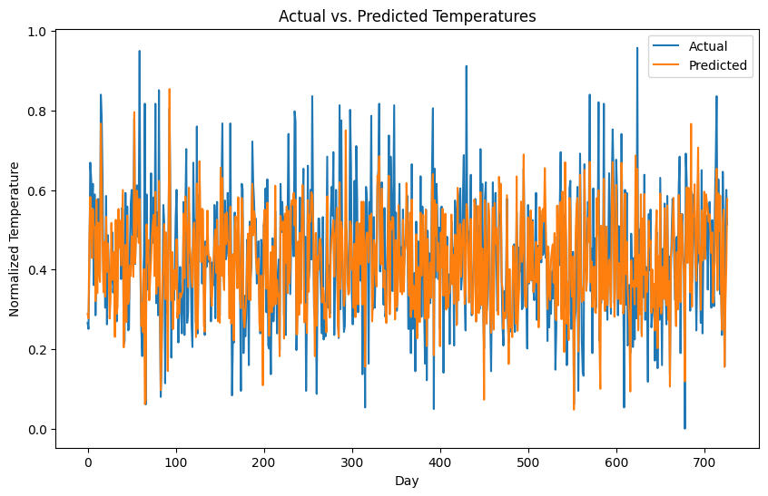

<div style="text-align: center;">

# Predicting Daily Temperatures using Artificial Neural Networks

</div>

<div style="text-align: center;">

*Vedanshi Vagehla*, *Rohit Kumar*
</div>

<div style="text-align: center;">

 *Indian Institute of Science Education and Research Bhopal*
</div>

---
<div style="text-align: center;">

#### **Abstract**

*Accurate daily temperature prediction is vital for various applications, including agriculture, energy management, and public safety. This project aims to design and implement an artificial neural network (ANN) using PyTorch to predict daily temperatures based on historical weather data. The process involves comprehensive data preprocessing, feature selection, and the construction of a robust ANN model. The model is trained and evaluated rigorously to ensure its accuracy and reliability in predicting temperatures. By leveraging the capabilities of ANNs to learn complex patterns from historical data, this project seeks to enhance the precision of daily temperature forecasts. The findings demonstrate the potential of ANNs in improving weather prediction models, contributing to better decision-making and resource management in weather-dependent sectors.*

</div>


<div>

## ***1. Introduction***
<section>
<p class="intro" style="text-align: left;">

### **1.1 Problem statement:**
- Accurate prediction of daily temperatures is crucial for various sectors, including agriculture, energy management, and public safety. Despite advances in weather forecasting, there remains a need for improved models that can leverage historical weather data to provide more precise daily temperature predictions. This project aims to design and implement an artificial neural network (ANN) using PyTorch to predict daily temperatures based on historical weather data. The challenge lies in effectively preprocessing the data, selecting appropriate features, and building a robust ANN model that can learn from past patterns to make accurate predictions. The project will also involve rigorous training and evaluation of the model to ensure its reliability and accuracy in real-world applications. By achieving this, the project seeks to contribute to the development of more efficient and accurate weather prediction models, ultimately aiding in better decision-making and resource management.
</p>
<p class="aim" style="text-align: right;">

### **1.2 Aim:**
- The aim of this project is to design, implement, and evaluate an artificial neural network (ANN) using PyTorch to accurately predict daily temperatures based on historical weather data. This includes comprehensive data preprocessing, selecting relevant features, building and training a robust ANN model, and conducting a thorough performance evaluation to ensure the model's effectiveness in real-world applications. The ultimate goal is to enhance the precision of daily temperature forecasts, thereby improving decision-making processes in sectors such as agriculture, energy management, and public safety.

</p>
</section>
</div>
<div>
<section>

## ***2. Data***
<p class="data">

- We will use the **Daily minimum temperatures in Melbourne dataset** from the `UCI Machine Learning Repository` or Kaggle. This dataset contains daily temperature observations for Melbourne, Australia, over a period of 10 years, 1981-1990.

### **2.1 Data exploration:**
- The first step in the analysis is to explore the dataset and understand its structure and contents. This involves examining the variables, checking for missing values, and gaining an overall understanding of the data distribution. Exploratory data analysis techniques such as summary statistics, histograms, and correlation analysis are employed to gain insights into the dataset.

- The dataset contains the following variables:
    1. date 
    2. min_temp

### **2.2 EDA:**
- We make use of the method of rolling average to generate sequences.

- We introduce some sequential data in the dataset, as weather data is naturally sequential, by considering the temperatures of the past few days, the model can learn patterns and trends that are useful for predicting future temperatures. This sequential information is crucial for accurate predictions.

```python
# Create rolling average features (you should try to learn more about rolling average and its importance in weather)
df['Temp_rolling_mean'] = df['Temp'].rolling(window=7).mean()

# Drop rows with NaN values generated by rolling mean
df.dropna(inplace=True)

# Display the first few rows of the dataframe with the new feature
print(df.head())
```
- We normalize the data to get it from 0 to 1 and then create sequences out of it.

```python
from sklearn.preprocessing import MinMaxScaler

# Initialize the scaler
scaler = MinMaxScaler()

# Normalize the temperature values
df['Temp'] = scaler.fit_transform(df[['Temp']])
df['Temp_rolling_mean'] = scaler.fit_transform(df[['Temp_rolling_mean']])
import numpy as np

def create_sequences(data, seq_length):
    sequences = []
    labels = []
    for i in range(len(data) - seq_length):
        seq = data[i:i + seq_length]
        label = data[i + seq_length]
        sequences.append(seq)
        labels.append(label)
    return np.array(sequences), np.array(labels)

# Define the sequence length (let say 7)
seq_length = 7

# Create sequences of data
X, y = create_sequences(df['Temp'].values, seq_length)

# Display the shape of the generated sequences
print(f"Shape of X: {X.shape}")
print(f"Shape of y: {y.shape}")

```

- We then split the data into training and testing set using `traintestsplit` from `sklearn` 

```python

from sklearn.model_selection import train_test_split

# Split the data into training and testing sets
X_train, X_test, y_train, y_test = train_test_split(X, y, test_size=0.2, shuffle=False)

# Convert the data to PyTorch tensors
X_train = torch.tensor(X, dtype=torch.float32)
y_train = torch.tensor(y, dtype=torch.float32).view(-1, 1)
X_test = torch.tensor(X_test, dtype=torch.float32)
y_test = torch.tensor(y_test, dtype=torch.float32).view(-1, 1)
```

- The rows after performing the above steps:

    1. date
    2. Temp
    3. Temp_Rolling_mean.

</p>

<section>
</div>
<div>

## ***3. Methodologies***
<section>
<p>

### **3.1 Artificial neural networks:**
- Artificial Neural Networks (ANNs) are a type of machine learning model inspired by the structure and function of the human brain. They consist of interconnected layers of nodes (neurons) that process and transform input data to recognize patterns and make predictions. Each neuron receives input, applies a weight, and passes the result through an activation function to produce an output. ANNs are highly versatile and can be used for various tasks, such as classification, regression, and clustering. Their ability to learn from data and improve over time makes them powerful tools in fields like image and speech recognition, natural language processing, and predictive analytics.

- For our task we define the neural network with the 
    
    1. input layer having 7 neurons 
    
    2. 2 hidden having 64 neurons each with ReLU activation.

    3. a output layer having single layer.

- We feed the x_train to the model and then make predictions and validate them against the x_test

### **3.2 Model Architecture:**
```python
# Simple neural network to perform regression
class RegressionNN(nn.Module):
    def __init__(self):
        super(RegressionNN, self).__init__()
        self.fc1 = nn.Linear(7, 64) #input layer
        self.relu1 = nn.ReLU()#activation of the first hidden layer
        self.fc2 = nn.Linear(64, 64)# connections between the 1st and 2nd hidden layer.
        self.relu2 = nn.ReLU()# activation for the last hidden layer.
        self.fc3 = nn.Linear(64, 1)# output layer

#x = x_train
    def forward(self, x):
        x = self.fc1(x)
        x = self.relu1(x)
        x = self.fc2(x)
        x = self.relu2(x)
        x = self.fc3(x)
        return x
```

- We define the training loss and training loop to moniter the loss while training. 

```python
model = RegressionNN()
# Loss function 
criterion = nn.MSELoss()

# Optimizer
optimizer = torch.optim.Adam(model.parameters(), lr=0.001)
num_epochs = 10000
for epoch in range(num_epochs):
    model.train()  # Set the model to training mode

    # Forward pass
    outputs = model(x_train)
    loss = criterion(outputs, y_train) #checkin the loss against the y_train.
    
    # Backward pass and optimization
    optimizer.zero_grad()  # Clear the gradients
    loss.backward()        # Compute gradients
    optimizer.step()       # Update the weights

    # Print loss every 100 epochs
    if (epoch+1) % 100 == 0:
        print(f'Epoch [{epoch+1}/{num_epochs}], Loss: {loss.item():.4f}')
model.eval()
with torch.no_grad():
    predictions = model(x_test)
    rmse = torch.sqrt(criterion(predictions, y_test))
    print(f"Test RMSE: {rmse.item()}")
```

- Then we plot the reults along side the original dataset.

    

- seeing the predictions for a few random days
```python
num_predictions = 6

for i in range(num_predictions):
    # Select the last 7 days of normalized temperature for prediction
    start_index = -(i + 8)  # Adjusted to ensure slicing works properly
    end_index = -(i + 1)    # Exclusive end index

    # Ensure the slicing works even if we reach the start of the array
    if start_index < -len(df['norm_temp']):
        print("Not enough data to make more predictions")
        break

    new_data = df['norm_temp'].values[start_index:end_index]
    new_data = torch.tensor(new_data, dtype=torch.float32).view(1, -1)
    
    # Making predictions
    model.eval()
    with torch.no_grad():
        new_predictions = model(new_data)

    actual_temp_index = -7 + i + 1 # Index for actual temperature
    if actual_temp_index < -len(df['norm_temp']):
        print("Not enough data to compare actual values")
        break

    actual_temp = df['norm_temp'].values[actual_temp_index]
    print(f"Predicted temperature for the next day: {new_predictions.item()}\nActual temperature for the next day: {actual_temp}\n")
```
</p>
</section>

# Conclusion
<p>

- The final Test RMSE: 0.10528802126646042, RMSE is targetted to be very close to zero, the RMSE is still high here.

- the model is actually not able to predict the extreme tempratures i.e after 0.8 and before 0.1, its predicting the tempratues accurately between the ranges (0.1,0.8).

- increasing the iterations also did not help, it led to over fitting as loss increased from 0.10 to 0.12 with increase in iterations.

- for improving the performance finding a combination of hyperparameters and optimizer such that loss appoches 0.
</p>
</footer>
